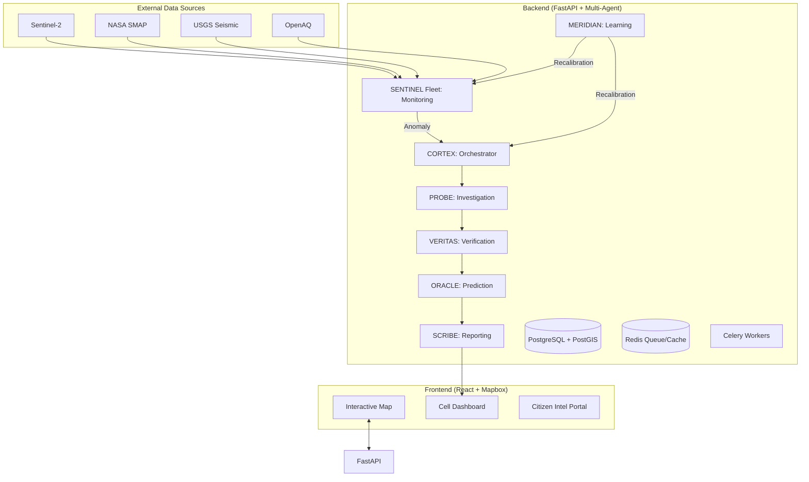

# STRATUM — Autonomous Planetary Infrastructure Intelligence

## 🏗️ System Architecture

STRATUM is a distributed, multi-agent geospatial intelligence platform designed for predictive infrastructure monitoring and disaster mitigation.

### 1. High-Level Diagram (Conceptual)


## 📂 Folder Structure

```text
stratum/
├── backend/                # FastAPI Application
│   ├── app/
│   │   ├── agents/         # Multi-Agent Logic (Cortex, Sentinel, etc.)
│   │   ├── api/            # REST API endpoints
│   │   ├── core/           # Config, Security, Database connection
│   │   ├── models/         # SQLAlchemy/PostGIS models
│   │   ├── schemas/        # Pydantic schemas
│   │   ├── services/       # External API connectors (Sentinel, NASA)
│   │   └── main.py         # Entry point
│   ├── tests/
│   ├── alembic/            # Database migrations
│   └── requirements.txt
├── frontend/               # React + Vite + Tailwind
│   ├── src/
│   │   ├── components/     # UI Components (Map, Dash, etc.)
│   │   ├── hooks/          # Custom hooks
│   │   ├── store/          # Zustand state management
│   │   ├── utils/          # Mapbox/Deck.gl utilities
│   │   └── App.jsx
│   ├── public/
│   └── package.json
├── docker/                 # Containerization setup
│   ├── backend.Dockerfile
│   ├── frontend.Dockerfile
│   └── docker-compose.yml
└── README.md
```

## 🚀 Implementation Roadmap

### Phase 1: Foundation (Backend Core & DB)
1. Initialize FastAPI project.
2. Set up SQLAlchemy with PostGIS support.
3. Define `Cell` (H3 Grid) and `Anomaly` models.
4. Implement basic API for cell data.

### Phase 2: The SENTINEL Fleet (Data Ingestion)
1. Implement connectors for Sentinel-2 (NDVI) and NASA (Soil Moisture).
2. Build the `SentinelAgent` loop to monitor specific H3 cells.
3. Set up Redis/Celery for background polling.

### Phase 3: The Multi-Agent Cortex
1. Implement the `CortexAgent` (State Machine/Orchestrator).
2. Build `ProbeAgent` for historical and causal analysis (DoWhy).
3. Build `VeritasAgent` for cross-referencing news/social media.
4. Build `OracleAgent` for Monte Carlo simulations.

### Phase 4: Frontend (Interactive Map)
1. Initialize Vite + React project.
2. Integrate Mapbox GL JS with H3 grid overlay.
3. Build the "Cell Dashboard" with Recharts visualization.
4. Implement WebSockets for real-time anomaly alerts.

### Phase 5: Reporting & Learning
1. Build `ScribeAgent` for PDF/Markdown generation.
2. Build `MeridianAgent` for weekly model recalibration.
3. Final Polish: Premium UI (Glassmorphism, animations).

---

## 🛠️ Tech Stack Details

- **Backend**: Python 3.10+, FastAPI, Pydantic, SQLAlchemy, GeoAlchemy2.
- **Workers**: Celery + Redis.
- **ML/AI**: PyTorch (Anomaly detection), DoWay (Causality), Prophet (Forecasting).
- **Frontend**: React 18, TailwindCSS, Mapbox GL JS, Framer Motion (Animations), Lucide React (Icons).
- **Data**: H3 (Uber's Hierarchical Spatial Index).
